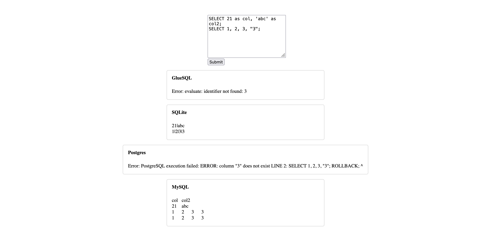

# comparesql

It is a tool to compare SQL query execution result between several SQL execution
engines.



## Commands

```bash
# Run SQLite, PostgreSQL, MySQL containers
docker compose up

# Run frontend server.
deno task dev
```
